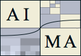

## Python 3.8
This code is in Python 3.8. Using typehints and f-strings, dataclasses.

## Index

| **Name** | Completed |
|:---------|:----------|
| Practical Task 1 | :heavy_check_mark: |
| Practical Task 2 | :heavy_check_mark: |
| Practical Task 3 | :heavy_check_mark: |
| LB 1 | :heavy_check_mark: |
| LB 2 | [x] |
| LB 3 | [x] |
| LB 4 | [x] |
 